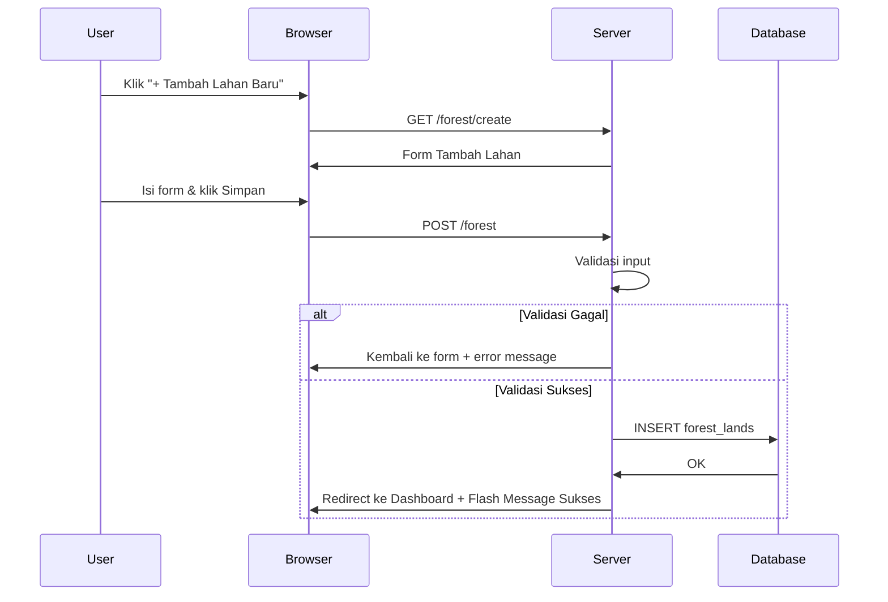

# Perhutanan — SaaS Manajemen Perhutanan

**Platform** SaaS (Software as a Service) berbasis web untuk monitoring dan manajemen data lahan hutan, kegiatan, serta hasil produksi hutan. Dirancang dengan prinsip **multi-tenant** sehingga setiap pengguna hanya dapat mengakses dan mengelola data miliknya sendiri.

> **Dokumentasi Akademik** — Project UAS Sistem Informasi / Web Development

---

## 📋 Daftar Isi

1. [Tentang Proyek](#tentang-proyek)
2. [Teknologi yang Digunakan](#teknologi-yang-digunakan)
3. [Studi Kasus](#studi-kasus)
4. [Rumusan Masalah](#rumusan-masalah)
5. [Fitur Aplikasi](#fitur-aplikasi)
6. [Struktur Database](#struktur-database)
7. [Instalasi & Setup](#instalasi--setup)
8. [Cara Penggunaan](#cara-penggunaan)
9. [Arsitektur Aplikasi](#arsitektur-aplikasi)
10. [Testing & Development](#testing--development)
11. [Troubleshooting](#troubleshooting)
12. [Kontribusi & Lisensi](#kontribusi--lisensi)

---

## 🎯 Tentang Proyek

### Latar Belakang

Pengelolaan data perhutanan di Indonesia masih banyak dilakukan secara manual menggunakan spreadsheet (Excel). Pendekatan ini memiliki banyak kelemahan: data tercampur antar perusahaan atau individu, rentan hilang, tidak ada sistem autentikasi, sulit melakukan tracking perubahan, dan tidak bisa diakses dari mana saja.

**Perhutanan** hadir sebagai solusi berbasis SaaS (Software as a Service) yang memungkinkan pengelola hutan — baik perusahaan, kelompok tani hutan, maupun individu — untuk mencatat, memonitor, dan mengekspor data lahan serta hasil hutan secara digital, aman, dan terisolasi per pengguna.

### Tujuan Aplikasi

1. Menyediakan sistem pencatatan data lahan hutan yang terstruktur dan digital
2. Menerapkan konsep multi-tenant agar data setiap pengguna terisolasi dengan aman
3. Memudahkan tracking kegiatan pada setiap lahan hutan
4. Memonitoring hasil produksi hutan (komoditas, volume, waktu panen)
5. Menyediakan fitur ekspor laporan ke format Excel
6. Menerapkan sistem autentikasi dan keamanan web yang baik

---

## ⚙️ Teknologi yang Digunakan

### Backend

| Teknologi | Versi | Fungsi |
|-----------|-------|--------|
| **Laravel Framework** | 12.0 | PHP Framework utama dengan pola MVC |
| **PHP** | 8.2+ | Bahasa pemrograman backend |
| **Laravel Breeze** | — | Authentication scaffolding (register, login, logout) |
| **Laravel Tinker** | 2.10.1 | Interactive shell untuk debugging |
| **Maatwebsite Excel** | * | Library ekspor data ke format Excel |

### Frontend

| Teknologi | Versi | Fungsi |
|-----------|-------|--------|
| **Tailwind CSS** | 3.1.0 | Utility-first CSS framework untuk styling UI |
| **Alpine.js** | 3.4.2 | JavaScript library interaktif ringan |
| **Vite** | 7.0.7 | Build tool modern untuk asset bundling |
| **@tailwindcss/forms** | 0.5.2 | Reset style default form Tailwind |
| **Axios** | 1.11.0 | HTTP client untuk komunikasi frontend-backend |

### Database

| Teknologi | Deskripsi |
|-----------|-----------|
| **MySQL** (via XAMPP / Laragon) | Database relasional untuk production |
| **SQLite** | Database opsional untuk development lokal |
| **Eloquent ORM** | Object-Relational Mapping bawaan Laravel |

### Development Tools

| Teknologi | Versi | Fungsi |
|-----------|-------|--------|
| **Concurrently** | 9.0.1 | Menjalankan multiple processes secara paralel |
| **Laravel Pail** | 1.2.2 | Tail log langsung di terminal |
| **Laravel Sail** | 1.41 | Development environment via Docker |
| **Laravel Pint** | 1.24 | PHP code style fixer (PSR-12) |
| **PHPUnit** | 11.5.50 | Framework testing |

### Diagram Stack Teknologi

```
┌─────────────────────────────────────────────┐
│             BROWSER (Client)                │
│  HTML · Blade Template · Tailwind CSS       │
│  Alpine.js · Axios                          │
└──────────────────┬──────────────────────────┘
                   │ HTTP Request / Response
┌──────────────────▼──────────────────────────┐
│          VITE (Asset Bundling)              │
│  Laravel Vite Plugin · PostCSS             │
└──────────────────┬──────────────────────────┘
                   │
┌──────────────────▼──────────────────────────┐
│             LARAVEL 12 (Backend)            │
│  ┌─────────┐ ┌──────────┐ ┌────────────┐   │
│  │ Routes  │ │Controller│ │  Model     │   │
│  │ web.php │ │   BC     │ │ Eloquent   │   │
│  └─────────┘ └──────────┘ └────────────┘   │
│  · Middleware (auth, CSRF)                  │
│  · Validasi Backend                         │
└──────────────────┬──────────────────────────┘
                   │
┌──────────────────▼──────────────────────────┐
│            DATABASE (MySQL)                 │
│  · forest_lands                             │
│  · forest_productions                       │
│  · land_activities                          │
│  · users (default Laravel)                  │
└─────────────────────────────────────────────┘
```

---

## 📖 Studi Kasus

### Konteks Permasalahan

**PT. Hutan Lestari Nusantara** adalah perusahaan yang mengelola beberapa blok hutan produksi dan konservasi di wilayah Jawa Tengah. Saat ini, perusahaan menggunakan spreadsheet Excel untuk mencatat:

- Data lahan (luas, status, lokasi)
- Kegiatan harian (penanaman, pemeliharaan, penebangan)
- Hasil produksi (volume kayu, komoditas lain, tanggal panen)

**Permasalahan yang dihadapi:**

1. **Data tidak terpusat** — Setiap staf menyimpan file Excel sendiri-sendiri
2. **Tidak ada autentikasi** — Siapa pun bisa membuka dan mengubah data
3. **Sulit tracking riwayat** — Tidak ada catatan siapa mengubah data kapan
4. **Data rawan hilang** — File lokal rawan corrupt atau terhapus
5. **Laporan manual** — Setiap laporan bulanan harus dibuat ulang dari nol
6. **Tidak bisa diakses jarak jauh** — Data hanya tersedia di komputer kantor

### Solusi yang Ditawarkan

**Perhutanan** menyediakan platform SaaS dengan pendekatan multi-tenant yang mengakomodasi kebutuhan di atas:

| Masalah | Solusi Perhutanan |
|---------|-------------------|
| Data tidak terpusat | Database MySQL terpusat, bisa diakses dari mana saja via browser |
| Tidak ada autentikasi | Laravel Breeze dengan sistem register/login |
| Tracking riwayat | Timestamps otomatis (created_at, updated_at) |
| Data rawan hilang | Data tersimpan di database, bisa backup rutin |
| Laporan manual | Fitur export Excel otomatis |
| Akses jarak jauh | Web-based, cukup koneksi internet |

### Skenario Multi-Tenant

```
User A (Perusahaan Hutan Jati)
  ├── Blok A1 (Produksi, 50 Ha)
  ├── Blok A2 (Produksi, 30 Ha)
  └── Blok A3 (Reboisasi, 20 Ha)
  
User B (Yayasan Konservasi Hijau)
  ├── Zona Inti (Konservasi, 100 Ha)
  └── Zona Penyangga (Konservasi, 75 Ha)
```

**Prinsip:** User A **tidak bisa melihat** data milik User B, dan sebaliknya. Setiap query ke database otomatis difilter berdasarkan `user_id` dari pengguna yang sedang login.

### Alur Bisnis

```
Register / Login
      ↓
Halaman Dashboard — Menampilkan daftar lahan milik user
      ↓
┌─────────────────────────────────────────────────────┐
│ PENGELOLAAN LAHAN                                   │
│ Tambah → Edit → Lihat → Hapus data lahan hutan     │
└─────────────────────────────────────────────────────┘
      ↓
┌─────────────────────────────────────────────────────┐
│ KEGIATAN LAHAN                                      │
│ Catat kegiatan pada setiap lahan (penanaman, dll)  │
└─────────────────────────────────────────────────────┘
      ↓
┌─────────────────────────────────────────────────────┐
│ PRODUKSI HASIL HUTAN                                │
│ Input komoditas kayu/hasil hutan, jumlah, tanggal   │
└─────────────────────────────────────────────────────┘
      ↓
┌─────────────────────────────────────────────────────┐
│ EXPORT LAPORAN                                      │
│ Generate laporan Excel: Lahan · Kegiatan · Produksi │
└─────────────────────────────────────────────────────┘
```

---

## ❓ Rumusan Masalah

Berdasarkan studi kasus di atas, rumusan masalah yang dijawab oleh aplikasi **Perhutanan** adalah:

### Masalah 1: Digitalisasi Data Lahan Hutan
> **Bagaimana mengelola data lahan perhutanan secara digital dan terstruktur?**

Sistem menyediakan database relasional (MySQL) dengan migration Laravel untuk membuat tabel `forest_lands` secara terstruktur. Setiap lahan memiliki atribut: nama, luas (hektar), dan status (Produksi/Konservasi/Reboisasi). Pengguna dapat melakukan CRUD (Create, Read, Update, Delete) melalui antarmuka web yang responsif.

### Masalah 2: Isolasi Data Multi-Tenant
> **Bagaimana memastikan setiap pengguna hanya bisa mengakses datanya sendiri?**

Pendekatan **row-level security** dengan foreign key `user_id` di setiap tabel data. Setiap query yang dijalankan oleh Controller selalu difilter dengan:
```php
ForestLand::where('user_id', Auth::id())->get();
```
Sehingga data antar pengguna terisolasi secara otomatis tanpa perlu konfigurasi tambahan.

### Masalah 3: Tracking Kegiatan & Produksi
> **Bagaimana mencatat kegiatan dan hasil produksi pada setiap lahan hutan?**

Dibuat dua tabel relasi yang terhubung ke `forest_lands`:
- **`land_activities`** — Mencatat kegiatan pada lahan (jenis kegiatan, tanggal, keterangan)
- **`forest_productions`** — Mencatat hasil produksi (komoditas, jumlah, satuan, tanggal panen)

Keduanya memiliki foreign key `forest_land_id` yang menghubungkan data ke lahan tertentu.

### Masalah 4: Keamanan dan Validasi Data
> **Bagaimana memastikan data yang masuk valid dan aman?**

Diterapkan beberapa lapis keamanan:
- **Laravel Validation** — Validasi di backend untuk setiap input (required, numeric, min, max, in)
- **CSRF Protection** — Token `@csrf` di setiap form POST
- **Mass Assignment Protection** — Kolom `$fillable` di Model membatasi input yang bisa diisi
- **SQL Injection Prevention** — Eloquent ORM otomatis menggunakan prepared statements
- **Authentication Middleware** — Semua route kecuali halaman depan mewajibkan login

### Masalah 5: Pembuatan Laporan
> **Bagaimana menghasilkan laporan yang rapi dan siap pakai?**

Fitur ekspor ke Excel menggunakan package **Maatwebsite Excel**. Pengguna dapat mengekspor:
- Data lahan (`/export/lahan`)
- Data kegiatan (`/export/kegiatan`)
- Data produksi (`/export/produksi`)

File Excel langsung terdownload dengan format tabel yang rapi.

---

## ✨ Fitur Aplikasi

### Modul 1: Manajemen Lahan Hutan
| Fitur | Route | Method | Deskripsi |
|-------|-------|--------|-----------|
| Dashboard | `/dashboard` | GET | Menampilkan daftar lahan milik user dalam tabel |
| Tambah Lahan | `/forest/create` | GET | Form input data lahan baru |
| Simpan Lahan | `/forest` | POST | Proses simpan data lahan ke database |
| Edit Lahan | `/forest/{id}/edit` | GET | Form edit data lahan |
| Update Lahan | `/forest/{id}` | PUT | Proses update data lahan |
| Hapus Lahan | `/forest/{id}` | DELETE | Hapus data lahan dari database |

**Status Lahan:**
- 🟦 **Produksi** — Lahan aktif untuk produksi hasil hutan
- 🟩 **Konservasi** — Lahan untuk konservasi/ perlindungan alam
- 🟨 **Reboisasi** — Lahan dalam program penghijauan kembali

### Modul 2: Pencatatan Kegiatan Lahan
| Fitur | Route | Method | Deskripsi |
|-------|-------|--------|-----------|
| Daftar Kegiatan | `/kegiatan` | GET | Menampilkan semua kegiatan |
| Tambah Kegiatan | `/kegiatan` | POST | Simpan kegiatan baru |
| Update Kegiatan | `/kegiatan/{id}` | PUT | Edit kegiatan |
| Hapus Kegiatan | `/kegiatan/{id}` | DELETE | Hapus kegiatan |
| Export Kegiatan | `/export/kegiatan` | GET | Download Excel kegiatan |

### Modul 3: Monitoring Produksi Hasil Hutan
| Fitur | Route | Method | Deskripsi |
|-------|-------|--------|-----------|
| Daftar Produksi | `/produksi` | GET | Menampilkan data produksi |
| Tambah Produksi | `/produksi` | POST | Simpan data produksi baru |
| Update Produksi | `/produksi/{id}` | PUT | Edit data produksi |
| Hapus Produksi | `/produksi/{id}` | DELETE | Hapus data produksi |
| Export Produksi | `/export/produksi` | GET | Download Excel produksi |

**Atribut Produksi:** Komoditas, Jumlah, Satuan (m³/kg/ton), Tanggal, Catatan

### Modul 4: Sistem Pricing & Premium
| Fitur | Route | Method | Deskripsi |
|-------|-------|--------|-----------|
| Halaman Pricing | `/pricing` | GET | Menampilkan paket harga (Free/Premium) |
| Upgrade Premium | `/upgrade-premium` | POST | Upgrade akun ke premium |

### Modul 5: Manajemen Profil
| Fitur | Route | Method | Deskripsi |
|-------|-------|--------|-----------|
| Edit Profil | `/profile` | GET | Form edit profil |
| Update Profil | `/profile` | PATCH | Simpan perubahan profil |
| Hapus Akun | `/profile` | DELETE | Hapus akun beserta seluruh data |

### Fitur Lintas Modul
| Fitur | Deskripsi |
|-------|-----------|
| ✅ **Multi-Tenant** | Setiap user hanya lihat datanya sendiri |
| ✅ **Responsive UI** | Tampilan mobile-friendly dengan Tailwind CSS |
| ✅ **Flash Messages** | Notifikasi sukses/gagal setelah aksi |
| ✅ **Form Validation** | Validasi frontend + backend |
| ✅ **CSRF Protection** | Token keamanan di setiap form |
| ✅ **Export Excel** | Laporan siap download |

---

## 🗄️ Struktur Database

### Diagram Relasi (ERD)

```
┌─────────────────────────────────────────────────────────────────────┐
│                              users                                  │
├─────────────────────────────────────────────────────────────────────┤
│ id (PK) · name · email · password · remember_token · timestamps    │
└──────────────────────────┬──────────────────────────────────────────┘
                           │ 1
                           │
                           │ N (one-to-many)
                           │
┌──────────────────────────▼──────────────────────────────────────────┐
│                           forest_lands                               │
├─────────────────────────────────────────────────────────────────────┤
│ id (PK)                                                             │
│ user_id (FK → users.id, ON DELETE CASCADE)                         │
│ nama_lahan VARCHAR(255)                                             │
│ luas_hektar DECIMAL(8,2)                                            │
│ status ENUM('Produksi','Konservasi','Reboisasi')                   │
│ timestamps                                                          │
└──────────────────────────┬──────────────────────────────────────────┘
                           │ 1
               ┌───────────┴───────────┐
               │                       │
               │ N                     │ N
               │                       │
┌──────────────▼────────────┐ ┌───────▼────────────────────┐
│     land_activities       │ │   forest_productions       │
├───────────────────────────┤ ├────────────────────────────┤
│ id (PK)                   │ │ id (PK)                    │
│ forest_land_id (FK)       │ │ forest_land_id (FK)        │
│ jenis_kegiatan VARCHAR    │ │ komoditas VARCHAR(255)     │
│ tanggal DATE              │ │ jumlah DECIMAL             │
│ keterangan TEXT           │ │ satuan VARCHAR             │
│ timestamps                │ │ tanggal DATE               │
│                           │ │ catatan TEXT               │
│                           │ │ timestamps                 │
└───────────────────────────┘ └────────────────────────────┘
```

### Detail Tabel

#### Tabel: `users`
Tabel bawaan Laravel dengan tambahan dari Laravel Breeze.

| Kolom | Tipe | Keterangan |
|-------|------|------------|
| id | BIGINT (PK) | Primary Key |
| name | VARCHAR(255) | Nama lengkap |
| email | VARCHAR(255) | Email (unique) |
| password | VARCHAR(255) | Password (hashed bcrypt) |
| remember_token | VARCHAR(100) | Token "remember me" |
| created_at | TIMESTAMP | Auto |
| updated_at | TIMESTAMP | Auto |

#### Tabel: `forest_lands`
Tabel utama untuk data lahan hutan.

| Kolom | Tipe | Keterangan |
|-------|------|------------|
| id | BIGINT (PK) | Auto Increment |
| user_id | BIGINT (FK) | Foreign Key ke `users.id` |
| nama_lahan | VARCHAR(255) | Nama lahan/blok hutan |
| luas_hektar | DECIMAL(8,2) | Luas dalam hektar (contoh: 25.50) |
| status | ENUM | `Produksi`, `Konservasi`, atau `Reboisasi` |
| created_at | TIMESTAMP | Waktu dibuat |
| updated_at | TIMESTAMP | Waktu diupdate |

**Constraint:**
- `FK user_id → users.id ON DELETE CASCADE` — Hapus user → semua lahannya ikut terhapus

#### Tabel: `forest_productions`
Menyimpan data hasil produksi dari setiap lahan.

| Kolom | Tipe | Keterangan |
|-------|------|------------|
| id | BIGINT (PK) | Auto Increment |
| forest_land_id | BIGINT (FK) | Foreign Key ke `forest_lands.id` |
| komoditas | VARCHAR(255) | Jenis komoditas (kayu jati, dll) |
| jumlah | DECIMAL | Volume produksi |
| satuan | VARCHAR | Satuan (m³, kg, ton, batang) |
| tanggal | DATE | Tanggal panen/produksi |
| catatan | TEXT | Catatan tambahan (opsional) |
| timestamps | TIMESTAMP | created_at & updated_at |

#### Tabel: `land_activities`
Menyimpan riwayat kegiatan pada setiap lahan.

| Kolom | Tipe | Keterangan |
|-------|------|------------|
| id | BIGINT (PK) | Auto Increment |
| forest_land_id | BIGINT (FK) | Foreign Key ke `forest_lands.id` |
| jenis_kegiatan | VARCHAR | Jenis kegiatan (penanaman, pemeliharaan, tebang) |
| tanggal | DATE | Tanggal kegiatan |
| keterangan | TEXT | Deskripsi kegiatan |
| timestamps | TIMESTAMP | created_at & updated_at |

### Model & Relasi (Eloquent ORM)

**ForestLand.php:**
```php
class ForestLand extends Model
{
    protected $fillable = ['user_id', 'nama_lahan', 'luas_hektar', 'status'];

    public function user()
    {
        return $this->belongsTo(User::class);
    }
}
```

**ForestProduction.php:**
```php
class ForestProduction extends Model
{
    protected $fillable = [
        'forest_land_id', 'komoditas', 'jumlah', 'satuan', 'tanggal', 'catatan',
    ];

    protected $casts = [
        'tanggal' => 'date',
        'jumlah' => 'decimal:2',
    ];

    public function forestLand()
    {
        return $this->belongsTo(ForestLand::class);
    }
}
```

---

## 🚀 Instalasi & Setup

### Persyaratan Sistem

| Komponen | Versi Minimal | Keterangan |
|----------|---------------|------------|
| PHP | 8.2+ | Bahasa pemrograman backend |
| Composer | 2.x | Dependency manager PHP |
| Node.js | 18.x+ | Runtime JavaScript |
| NPM | 9.x+ | Package manager JavaScript |
| MySQL | 5.7+ / 8.x | Database relasional |
| XAMPP / Laragon | — | Server lokal (Apache + MySQL) |

### Langkah Instalasi

#### 1. Clone Repository

```bash
git clone https://github.com/username/perhutanan.git
cd perhutanan
```

#### 2. Install Dependencies

```bash
# Install semua dependency PHP (Laravel, Excel, dll)
composer install

# Install semua dependency Frontend (Tailwind, Alpine, Vite, dll)
npm install
```

#### 3. Konfigurasi Environment

```bash
# Copy file .env.example menjadi .env
cp .env.example .env

# Generate application key
php artisan key:generate
```

Edit file `.env` sesuaikan dengan konfigurasi lokal Anda:

```env
APP_NAME=Perhutanan
APP_URL=http://localhost:8000

DB_CONNECTION=mysql
DB_HOST=127.0.0.1
DB_PORT=3306
DB_DATABASE=perhutanan_db
DB_USERNAME=root
DB_PASSWORD=
```

#### 4. Setup Database

```bash
# Buka XAMPP/Laragon, pastikan Apache & MySQL running

# Buat database via phpMyAdmin atau terminal:
# mysql -u root -p -e "CREATE DATABASE perhutanan_db"

# Atau langsung: php artisan db:create (jika package tersedia)

# Jalankan migration untuk membuat tabel
php artisan migrate
```

#### 5. Build Asset Frontend

```bash
# Build untuk production
npm run build

# Atau development (hot reload)
npm run dev
```

#### 6. Jalankan Aplikasi

```bash
# Cara 1: Development server + Vite + Queue + Logs (Rekomendasi)
composer run dev

# Cara 2: Manual
php artisan serve    # Server di http://localhost:8000
npm run dev          # Vite development server
```

#### 7. Akses Aplikasi

Buka browser: **http://localhost:8000**

---

## 📖 Cara Penggunaan

### 1. Register & Login

| Langkah | Tindakan |
|---------|----------|
| 1 | Buka `http://localhost:8000/register` |
| 2 | Isi form: **Name**, **Email**, **Password**, **Confirm Password** |
| 3 | Klik tombol **Register** |
| 4 | Otomatis login dan diarahkan ke **Dashboard** |

Atau jika sudah punya akun, login di `http://localhost:8000/login`.

### 2. Dashboard — Melihat Daftar Lahan

Setelah login, halaman **Dashboard** menampilkan:
- Tabel daftar lahan milik user yang login
- Informasi: No, Nama Lahan, Luas (Ha), Status, Tanggal Input
- **Badge berwarna** untuk status (Biru=Produksi, Hijau=Konservasi, Kuning=Reboisasi)
- Tombol **"+ Tambah Lahan Baru"** di pojok kanan atas
- Pesan sukses jika baru selesai menambah data

Jika belum ada data, tampil **empty state** dengan ilustrasi dan ajakan untuk menambah lahan pertama.

### 3. Menambah Lahan Baru



**Form Input:**
| Field | Tipe Input | Contoh | Validasi |
|-------|-----------|--------|----------|
| Nama Lahan | Text | "Blok A1 Jati" | Required, max 255 |
| Luas Hektar | Number | "25.50" | Required, numeric, min 0.1 |
| Status | Dropdown | Produksi | Required, in: Produksi/Konservasi/Reboisasi |

### 4. Mengelola Kegiatan Lahan

1. Akses menu **Kegiatan** dari navigasi
2. Isi form:
   - Pilih lahan dari dropdown
   - Masukkan jenis kegiatan (penanaman, pemeliharaan, penebangan, dll)
   - Pilih tanggal kegiatan
   - Tambahkan keterangan (opsional)
3. Klik **Simpan**
4. Data kegiatan muncul di tabel

**Fitur:**
- ✅ Tambah kegiatan baru
- ✅ Edit kegiatan yang sudah ada
- ✅ Hapus kegiatan
- ✅ Export ke Excel

### 5. Mencatat Produksi Hasil Hutan

1. Akses menu **Produksi** dari navigasi
2. Isi form:
   - Pilih lahan (dropdown)
   - Masukkan **komoditas** (contoh: "Kayu Jati", "Getah Pinus", "Madu Hutan")
   - Masukkan **jumlah** (contoh: 100)
   - Pilih **satuan** (m³, kg, ton, batang)
   - Pilih **tanggal** produksi
   - Tambahkan **catatan** (opsional)
3. Klik **Simpan**
4. Data produksi muncul di tabel

### 6. Export Laporan ke Excel

| Menu | URL | File Export |
|------|-----|-------------|
| Lahan | `/export/lahan` | `lahan_perhutanan.xlsx` |
| Kegiatan | `/export/kegiatan` | `kegiatan_perhutanan.xlsx` |
| Produksi | `/export/produksi` | `produksi_perhutanan.xlsx` |

Cukup klik tombol **Export Excel** di halaman masing-masing, file langsung terdownload.

### 7. Mengelola Profil

1. Klik nama user di pojok kanan atas
2. Pilih **Profile**
3. Fitur:
   - Update **Name** dan **Email**
   - Ganti **Password**
   - Hapus **Akun** (beserta seluruh data lahan, kegiatan, produksi)

---

## 🏗️ Arsitektur Aplikasi

### Pola MVC (Model-View-Controller)

```
┌──────────────┐
│   Browser    │   Request / Response
└──────┬───────┘
       │
       ▼
┌──────────────┐
│   Routes     │   web.php — Mapping URL → Controller Method
│  (web.php)   │   Middleware: auth, CSRF
└──────┬───────┘
       │
       ▼
┌──────────────┐
│  Controller  │   Logika bisnis & validasi
│  (BC)        │   ForestLandController, ForestProductionController, dll
└──┬───────┬───┘
   │       │
   ▼       ▼
┌────────┐ ┌──────────┐
│ Model  │ │   View   │
│Eloquent│ │  Blade   │
│  ORM   │ │ Template │
└───┬────┘ └──────────┘
    │
    ▼
┌──────────┐
│ Database │
│  MySQL   │
└──────────┘
```

### Alur Request (Contoh: Tambah Lahan)

```
1. Browser: GET /forest/create
2. Routes: ForestLandController@create
3. Controller: return view('forest.create')
4. View: forest/create.blade.php → Form HTML
5. Browser: Menampilkan form

6. User: Isi form → Klik Submit
7. Browser: POST /forest (data form)
8. Routes: ForestLandController@store
9. Controller: Validasi input
10. Controller: ForestLand::create([...]) → INSERT ke MySQL
11. Controller: redirect('/dashboard') + flash message
12. Browser: Dashboard dengan data baru + notifikasi sukses
```

### Implementasi Multi-Tenant

Setiap Controller yang menampilkan data selalu menerapkan filter:

```php
// ForestLandController@index
public function index()
{
    // Hanya ambil data milik user yang sedang login
    $lands = ForestLand::where('user_id', Auth::id())->latest()->get();
    return view('forest.index', compact('lands'));
}

// ForestLandController@store
public function store(Request $request)
{
    // validasi...
    ForestLand::create([
        'user_id' => Auth::id(),  // Otomatis mengikat data ke user
        // ...
    ]);
}
```

### Lapisan Keamanan

| Lapisan | Mekanisme | Lokasi |
|---------|-----------|--------|
| **1. Authentication** | Middleware `auth` | `routes/web.php` |
| **2. CSRF Protection** | Token `@csrf` | Blade template |
| **3. Input Validation** | `$request->validate(...)` | Controller |
| **4. Mass Assignment** | `$fillable` array | Model |
| **5. SQL Injection** | Eloquent ORM (prepared statements) | Model / Query Builder |

---

## 🧪 Testing & Development

### Menjalankan Test

```bash
# Jalankan semua test (Unit + Feature)
composer run test

# Atau langsung dengan PHPUnit
php artisan test
```

### Code Style Fix

```bash
# Perbaiki code style otomatis (PSR-12)
./vendor/bin/pint
```

### Development Mode (Hot Reload)

```bash
# Menjalankan 4 proses sekaligus:
# 1. php artisan serve — Server Laravel
# 2. php artisan queue:listen — Queue worker
# 3. php artisan pail — Log viewer terminal
# 4. npm run dev — Vite hot reload

composer run dev
```

Proses berjalan paralel dengan label warna:
- `server` (biru) — Laravel development server
- `queue` (ungu) — Queue listener
- `logs` (merah) — Real-time logs
- `vite` (oranye) — Vite HMR

### Production Build

```bash
# Build asset untuk production
npm run build

# Optimasi Laravel
php artisan optimize
php artisan config:cache
php artisan route:cache
php artisan view:cache
```

### Environment Variables Penting

| Variable | Default | Keterangan |
|----------|---------|------------|
| `APP_NAME` | Perhutanan | Nama aplikasi |
| `APP_ENV` | local | Ubah ke `production` untuk deployment |
| `APP_DEBUG` | true | Matikan (`false`) di production |
| `APP_URL` | http://localhost | URL aplikasi |
| `DB_CONNECTION` | sqlite | Ubah ke `mysql` untuk XAMPP |
| `DB_DATABASE` | perhutanan_db | Nama database |
| `SESSION_DRIVER` | database | Gunakan database untuk session |

---

## 🔧 Troubleshooting

### Error: "SQLSTATE[HY000] [2002] No connection could be made"

**Penyebab:** MySQL tidak berjalan.

**Solusi:**
```
1. Buka XAMPP Control Panel
2. Klik "Start" pada MySQL
3. Pastikan port 3306 tidak dipakai aplikasi lain
```

### Error: "Target class [ForestLandController] does not exist"

**Penyebab:** Composer autoload belum refresh.

**Solusi:**
```bash
composer dump-autoload
```

### Error: "Vite manifest not found"

**Penyebab:** Asset frontend belum di-build.

**Solusi:**
```bash
npm install
npm run build
```

### Error: "The only supported ciphers are AES-128-CBC and AES-256-CBC"

**Penyebab:** APP_KEY belum di-generate.

**Solusi:**
```bash
php artisan key:generate
```

### Error: "Route [dashboard] not defined"

**Penyebab:** Route belum terdaftar atau cache routing usang.

**Solusi:**
```bash
php artisan route:clear
# Pastikan route dashboard ada di routes/web.php
```

### Error: "Class 'Maatwebsite\Excel\ExcelServiceProvider' not found"

**Penyebab:** Package maatwebsite/excel belum terinstall.

**Solusi:**
```bash
composer require maatwebsite/excel
```

### Error: 419 Page Expired

**Penyebab:** CSRF token tidak valid (session expired atau @csrf hilang).

**Solusi:**
- Refresh halaman
- Pastikan ada `@csrf` di setiap form POST
- Periksa konfigurasi session di `.env`

### Error: "Blank page / White screen"

**Penyebab:** Error PHP yang tidak ditampilkan (APP_DEBUG=false).

**Solusi:**
```bash
# Sementara, set APP_DEBUG=true di .env
# Lalu lihat error detailnya
```

### Error: Database Migration Gagal

**Solusi:**
```bash
# Rollback migration
php artisan migrate:rollback

# Hapus semua tabel lalu migrate ulang
php artisan migrate:fresh

# Lihat status migration
php artisan migrate:status
```

---

## 🤝 Kontribusi & Lisensi

### Cara Berkontribusi

Kami sangat terbuka untuk kontribusi dari siapa pun! Berikut langkah-langkahnya:

```bash
# 1. Fork repository ini

# 2. Clone hasil fork
git clone https://github.com/username-mu/perhutanan.git

# 3. Buat branch fitur
git checkout -b fitur/namafitur

# 4. Lakukan perubahan dan commit
git add .
git commit -m "feat: tambah fitur X"

# 5. Push ke branch
git push origin fitur/namafitur

# 6. Buat Pull Request ke repository utama
```

### Aturan Kontribusi

- Ikuti **PSR-12** coding standard (cek dengan `./vendor/bin/pint`)
- Tulis kode dengan **clean code** dan **meaningful variable names**
- Tambahkan **komentar** untuk logika yang kompleks
- Pastikan **tidak ada error** sebelum pull request
- Gunakan **conventional commits**:
  - `feat:` — Fitur baru
  - `fix:` — Perbaikan bug
  - `docs:` — Perubahan dokumentasi
  - `refactor:` — Refactor kode (tanpa perubahan fungsional)
  - `style:` — Perubahan style (formatting, spacing)

### Lisensi

**MIT License**

```
Copyright (c) 2026 Perhutanan

Permission is hereby granted, free of charge, to any person obtaining a copy
of this software and associated documentation files (the "Software"), to deal
in the Software without restriction, including without limitation the rights
to use, copy, modify, merge, publish, distribute, sublicense, and/or sell
copies of the Software, and to permit persons to whom the Software is
furnished to do so, subject to the following conditions:

The above copyright notice and this permission notice shall be included in all
copies or substantial portions of the Software.
```

### Credits & Referensi

| Resource | Link |
|----------|------|
| Laravel Documentation | https://laravel.com/docs |
| Tailwind CSS Documentation | https://tailwindcss.com/docs |
| Laravel Breeze | https://laravel.com/docs/starter-kits |
| Alpine.js | https://alpinejs.dev/ |
| Maatwebsite Excel | https://docs.laravel-excel.com/ |
| Vite | https://vitejs.dev/ |

### Kontak

- **Project**: Perhutanan — SaaS Manajemen Perhutanan
- **Dokumentasi**: README.md
- **Teknologi**: Laravel 12 + MySQL + Tailwind CSS

---

<p align="center">
  <sub>Dibuat untuk memenuhi tugas UAS — Sistem Informasi / Web Development</sub><br>
  <sub>© 2026 Perhutanan. All rights reserved.</sub>
</p>
